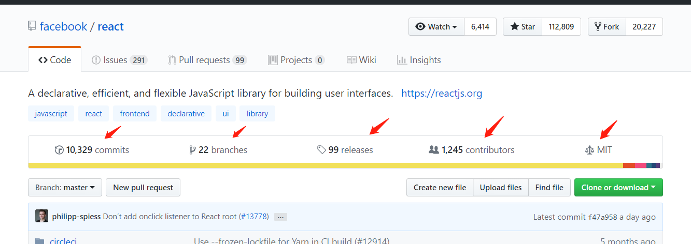
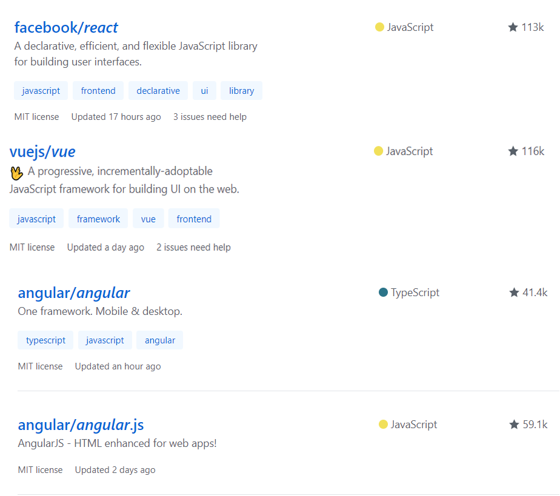
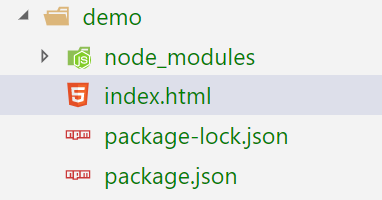
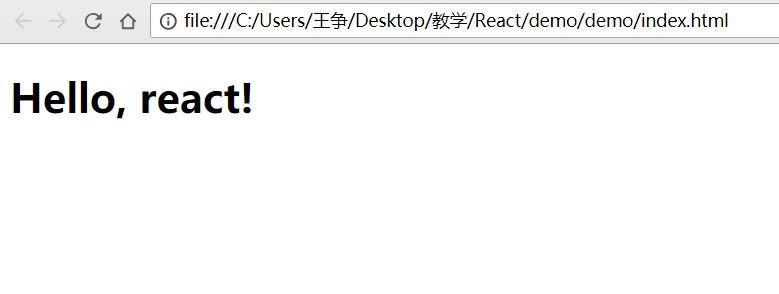
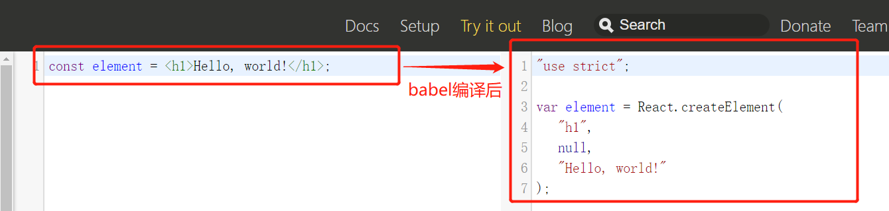
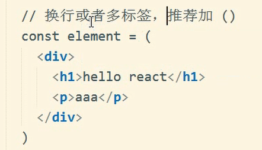
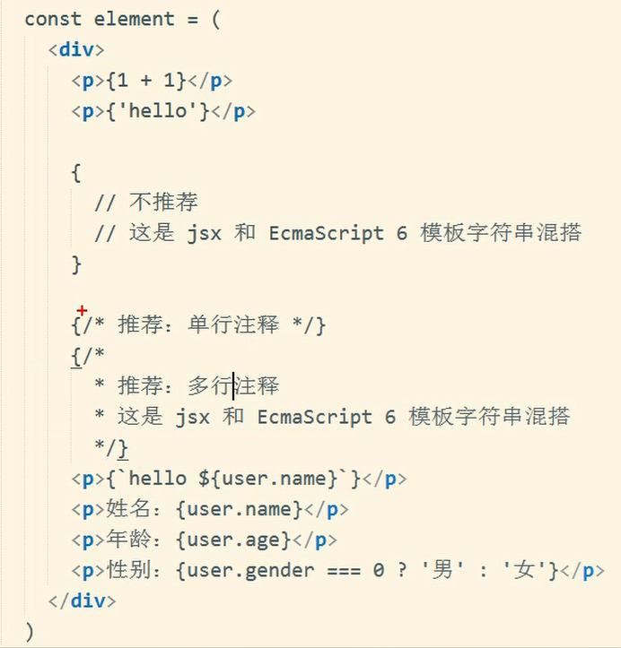
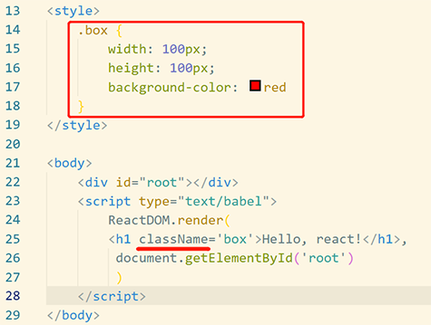
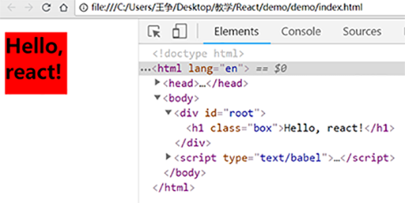
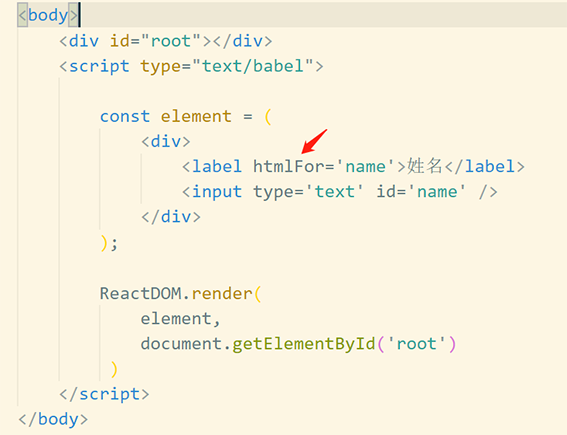

# React 简介

​     

## 是什么？       

React 是一个用于构建用户界面的渐进式 JavaScript 库

- 本身只处理 UI
- 不关心路由
- 不处理 ajax

​       React 起源于 Facebook 的内部项目，因为该公司对市场上所有 JavaScript MVC 框架，都不满意，就决定自己写一套，用来架设Instagram 的网站。做出来以后，发现这套东西很好用，就在2013年5月开源了。

​       由于 React的设计思想极其独特（组件化），属于革命性创新，性能出众，代码逻辑却非常简单。所以，越来越多的人开始关注和使用，认为它可能是将来 Web 开发的主流工具。

​      这个项目本身也越滚越大，从最早的UI引擎变成了一整套前后端通吃的 Web App 解决方案。衍生的 React Native 项目，目标更是宏伟，希望用写 Web App 的方式去写 Native App。如果能够实现，整个互联网行业都会被颠覆，因为同一组人只需要写一次 UI ，就能同时运行在浏览器和手机。

## React 特点

- 组件化
- 高效
  - 虚拟 DOM
  - Vue 2 也是虚拟 DOM
  - 虚拟 DOM 更高效
- 灵活
  - 渐进式，本身只处理 UI ，可以和你的其它技术栈组合到一起来使用
- 声明（配置）式设计
  - `data` 响应式数据
  - `mathods` 处理函数
  - 这样做的好处就是按照我们约定好的方式来开发，所有人写出来的代码就像一个人写的
  - `state`
  - 方法就是类成员
  - 也有特定的组件生命钩子
- JSX
  - 一种预编译 JavaScript 语言，允许让你的 JavaScript 和 HTML 混搭
  - 模板中就是 JavaScript 逻辑
- 单向数据流
  - 组件传值
  - 所有数据都是单向的，组件传递的数据都是单向
  - Vue 也是单向数据流
  - 没有双向数据绑定

## React 发展历史

- Facebook 内部用来开发 Instagram
- 2013 年开源了 React
- 随后发布了 React Native
- React 开源协议
  - [知乎专栏 -React 的许可协议到底发生了什么问题？](https://zhuanlan.zhihu.com/p/28618630)
  - [知乎 - 如何看待 Facebook 计划将 React 改为 MIT 许可证？](https://www.zhihu.com/question/65728078)
  - [阮一峰 - 开源许可证教程](http://www.ruanyifeng.com/blog/2017/10/open-source-license-tutorial.html)
  - [阮一峰 - 如何选择开源许可证](http://www.ruanyifeng.com/blog/2011/05/how_to_choose_free_software_licenses.html)
  - React  最后架不住社区的压力，最后还是修改了许可协议条款。我分享，我骄傲。


- React 版本

  ​    


  - 2013 年 7 月 3 日 `v0.3.0`
  - 2016 年 3 月 30 日 `v0.14.8`
  - 2016 年 4 月 9 日 `v15.0.0`
  - 2017 年 9 月 27 日 `v16.0.0`
  - 截止到目前：2018 年 10 月 10日 [v16.5.2](https://github.com/facebook/react/releases/tag/v16.5.2)

# React、Vue对比

看看github星数吧



## 技术层面

- Vue 生产力更高（更少的代码实现更强劲的功能）
- React 技术占比比较重
- 两个框架的效率都采用了虚拟 DOM
  - 性能都差不多
- 组件化
  - Vue 支持
  - React 支持
- 数据绑定
  - 都支持数据驱动视图
  - Vue       支持表单控件双向数据绑定
  - React    不支持表单控件双向数据绑定
- 它们的核心库都很小，都是渐进式 JavaScript 库
- React 采用 JSX 语法来编写组件
- Vue 采用单文件组件
  - `template`
  - `script`
  - `style`

## 开发团队

- React 由 Facebook 前端维护开发

- Vue

  - 早期只有尤雨溪一个人

    

  - 由于后来使用者越来越多，后来离职专职开发维护

    

  - 目前也有一个小团队在开发维护

## 社区

- React 社区比 Vue 更强大
- Vue 社区也很强大

## Native APP 开发

- React Native
  - 可以原生应用
  - React 结束之后会学习
- Weex
  - 阿里巴巴内部搞出来的一个东西，基于 Vue

## 相关资源链接

- [React 官网](https://reactjs.org/)
- [官方教程](https://reactjs.org/tutorial/tutorial.html)
  - 连字游戏
- [官方文档](https://reactjs.org/docs/)
  - 基础教程
  - 高级教程
  - API 参考文档
- [React - GitHub](https://github.com/facebook/react)
- [阮一峰 - React 技术栈系列教程](http://www.ruanyifeng.com/blog/2016/09/react-technology-stack.html)
- [阮一峰 - React 入门实例教程]（http://www.ruanyifeng.com/blog/2015/03/react.html
- [awesome react](https://github.com/enaqx/awesome-react)
- [awesome-react-components](https://github.com/brillout/awesome-react-components)

# React 核心概念

## 组件化


## 虚拟 DOM

> 虚拟 DOM 对于使用者来讲完全不用关心

- [知乎 - 如何理解虚拟DOM？](https://www.zhihu.com/question/29504639)
- [深度剖析：如何实现一个 Virtual DOM 算法](https://github.com/livoras/blog/issues/13)
- [理解 Virtual DOM](https://github.com/y8n/blog/issues/5)
- [深入浅出React（四）：虚拟DOM Diff算法解析](http://www.infoq.com/cn/articles/react-dom-diff)
- [全面理解虚拟DOM，实现虚拟DOM](https://foio.github.io/virtual-dom/)
- [50行代码实现Virtual DOM](http://www.jianshu.com/p/cbb7d7094fb9)
- [网上都说操作真实 DOM 慢，但测试结果却比 React 更快，为什么？](https://www.zhihu.com/question/31809713)

## JSX

虚拟 DOM 写起来麻烦，所以提供了 JSX 的方式


# 安装react

## 开发环境安装

安装项目依赖的包

```shell
mkdir demo
cd demo
npm init
npm install --save react react-dom @babel/standalone
echo >index.html  （echo后面不要忘了空格，代表向index.html里面输入一个空格）
```




对安装的react、react-dom、@babel/standalone 包进行解释

```text
react ?

    React 的核心库

react-dom?

    提供与 DOM 相关的功能

@babel/standalone?

    Babel 可以将 ES6 代码转为 ES5 代码，这样我们就能在目前不支持 ES6 浏览器上执行 React 代码。

    Babel 内嵌了对 JSX 的支持。

```


index.html 里面的内容如下

```html
<!DOCTYPE html>
<html lang="en">

<head>
  <meta charset="UTF-8">
  <title>demo - Hello World</title>
  <script src="node_modules/@babel/standalone/babel.js"></script>
  <script src="node_modules/react/umd/react.development.js"></script>
  <script src="node_modules/react-dom/umd/react-dom.development.js"></script>
</head>

<body>
  <div id="root"></div>
  <script type="text/babel">
    ReactDOM.render(
      <h1>Hello, react!</h1>,
      document.getElementById('root')
    )
  </script>
</body>

</html>
```


运行index.html，得到如下页面



## 脚手架方式 

  (创建单页面应用程序)`create-react-app`


1. 全局安装 create-react-app ：

   > npm install -g create-react-app

2. 创建 myDemo 项目 : 

   > create-react-app myDemo

3. 切换到myDemo目录下

   > cd myDemo

4. 启动项目

   > npm start


   

5.浏览器会自动打开运行好的项目


React 目录结构

**package.json**


这个文件是管理下载的依赖包,在项目中经常用到的是"react"库，“react-dom”（将jsx语法渲染到dom中）

在项目中最重要的命令是“start”启动项目，"bulid"的作用就是将项目打包。


**node_modules：**

这里面包含了react项目中会用到的一些组件，install的时候下载下来的


**public文件夹**

   1).favicon.ico

​       是浏览器tab上图标，也是这个项目的一个标志，也可以说是代表一个公司的标志。可以替换。

   2).index.html

​       项目的入口文件，引用了第三方类库啊，还可以引入cdn

​      <div id="root"></div> 是项目的总容器，所有的内容存储在这个容器中。这个容器有且只能有一个。

 **src：**

1).index.js

​    

src 里面存放的是这个项目的核心内容，也就是我们的主要工作区域。

其中，index.js文件是和index.html进行关联的文件。index.js的内容结构：

```react
import React from 'react';
import ReactDOM from 'react-dom';
import './index.css';
import App from './App';
import registerServiceWorker from './registerServiceWorker';

ReactDOM.render(<App />, document.getElementById('root'));
registerServiceWorker();
```

ReactDOM.render(）的作用是将<App/>的内容渲染到根“root”中去。

document.getElementById('root')中的"root"便是index.html中的"root"了，

<App />便是引用页面内容了。

在这里，<App />也可以写一些内容(结构,样式,逻辑)是整个项目的根组件，比如:

ReactDOM.render(<p >Hello World</p>, document.getElementById('root'));

运行结果（前提是本地服务器启动，打开localhost:3000）如下：


 2).App.js

 

App类是继承react提供的component，

export default App;是为了将App公开，index.js才能够引用。

App.js继承了component的话，必须使用render进行渲染。

return的内容是类似于html结构的内容，就是jsx，

jsx语法是react的主要语法。

内部的div的className是为了区分html语法的一个类名，

这个是div的样式引用。在这个文件中，只能用一个div容器，如果在div的同级目录添加别的内容，便会报错。


className="App"，是引用到App.css的样式。


注意，页面内容样式是就近原则，

首先用App.css的样式，App.css是组件的样式，index.css是全局的样式。

## CDN方式

```react
<!DOCTYPE html>
<html>
<head>
<meta charset="UTF-8" />
<title>Hello React!</title>
<script src="https://cdn.bootcss.com/react/16.4.0/umd/react.development.js"></script>
<script src="https://cdn.bootcss.com/react-dom/16.4.0/umd/react-dom.development.js"></script>
<script src="https://cdn.bootcss.com/babel-standalone/6.26.0/babel.min.js"></script>
</head>
<body>
 
<div id="example"></div>
    
<!-- react 使用的是JSX语法，如果我们需要使用 JSX，
则script标签的 type 属性需要设置为 text/babel。 -->
    
<script type="text/babel">
    
    
/* 将一个 h1 标题，插入 id="example" 节点中。*/ 

ReactDOM.render(
    <h1>Hello, world!</h1>,
    document.getElementById('example')
);
</script>
 
</body>
</html>
```


# JSX 语法

 JSX 是 react 中允许 js 和 html 混写的语法格式，需要依赖 babel 编译。

官网最权威，最准确！官网地址：  <a href="https://reactjs.org/docs/introducing-jsx.html">官网JSX</a>

## 环境配置

- 非模块化环境
  - `babel-standalone`
  - 执行时编译，速度比较慢
  - 只适用于开发测试环境
- 模块化环境
  - 结合 webpack 配置 babel 响应的工具完成预编译
  - 浏览器执行的是预编译结果
- Babel REPL 赋值查看编译结果
  - 使用在线测试

这里我就只研究它的语法：

```react
const element = <h1>Hello, world!</h1>;
```

看不懂？

没关系

jsx 语法浏览器读不懂啊，jsx是需要babel来进行编译成js 浏览器才能识别那

让我们打开 <a href='https://babeljs.io/repl'>babel</a> 试一下吧！




可以看到，编译后的代码，是 js 写的东东，这样浏览器才能晓得

## 基本语法规则

- 必须只能有一个根节点

- 多标签 或者 换行 推荐加（）

  

- 遇到 HTML 标签 （以 `<` 开头） 就用 HTML 规则解析 

  - 单标签不能省略结束标签。

- 遇到代码块（以 `{` 开头），就用 JavaScript 规则解析

- JSX 允许直接在模板中插入一个 JavaScript 变量

  - 如果这个变量是一个数组，则会展开这个数组的所有成员添加到模板中

- 单标签必须加结束 `/>`

  ```react
      以下是不正确的
      
       ReactDOM.render(
          <input type='text'>,
          document.getElementById('root') 
       )
       
      以下是正确的
      
       ReactDOM.render(
          <input type='text' />,
          document.getElementById('root') 
       )
      
  ```


## JSX 中嵌入js表达式


**js表达式写在 { } 中，注意不是 {{ }}**


```react
function formatName(user) {
  return user.firstName + ' ' + user.lastName;
}

const user = {
  firstName: 'Harper',
  lastName: 'Perez'
};

const element = (
  <h1>
    Hello, {formatName(user)}!
  </h1>
);

ReactDOM.render(
  element,
  document.getElementById('root')
);
```

```react
const user = {
  name: '张三',
  age: 18,
  gender: 0
}

const element = (
  <div>
    <p>{1+1}</p>
    <p>{'zhang'+'san'}</p>    
    <p>姓名：{user.name}</p>
    <p>年龄：{user.age}</p>
    <p>性别：{user.gender === 0 ? '男' : '女'}</p>
  </div>
)
```

## 在 JSX 中使用注释

在 JavaScript 中的注释还是以前的方式：

```javascript
// 单行注释

/*
 * 多行注释
 */
```

在 jsx 的标签中写注释需要注意：

写法一（不推荐）：

```jsx
{
  // 注释
  // ...
}
```

写法二（推荐，把多行写到单行中）：

```
{/* 单行注释 */}
```

写法三（多行）：

```jsx
{
  /*
   * 多行注释
   */
}
```



##  在JS中嵌入JSX

```react
function getGreeting (user) {
  if (user) {
    return <h1>Hello, {user.name}</h1>
  }
  return <h1>Hello, Stranger.</h1>
}

const user = {
  name: 'Jack'
}

const element = getGreeting(user)

ReactDOM.render(
  element,
  document.getElementById('root')
)
```

## JSX 中的节点属性

​    JSX  的本质是 javascript

​    class 、for 在 javascript 中是一个关键字

​    JSX 中的 class  要使用  className , for 要使用 htmlFor









`tabindex` 使用 `tabIndex`

```jsx
const element = <div tabIndex="0"></div>;
```


在属性中使用表达式：

```jsx
const element = </img>;

注意不能像下面这样写：

const element = </img>;
```


## 声明子节点

- 必须有且只有一个根节点

如果标签是空的，可以使用 `/>` 立即关闭它。

```jsx
const element = ;
```

JSX 子节点可以包含子节点（最好加上小括号）：

```jsx
const element = (
  <div>
    <h1>Hello!</h1>
    <h2>Good to see you here.</h2>
  </div>
);
```

## JSX原理

Babel 会把 JSX 编译为 `React.createElement()` 函数。


下面两种方式是等价的：

```jsx
const element = (
  <h1 className="greeting">
    Hello, world!
  </h1>
);
```

```jsx
const element = React.createElement(
  'h1',
  {className: 'greeting'},
  'Hello, world!'
);
```

## JSX 语法高亮

安装插件！

## 列表渲染

> https://reactjs.org/docs/lists-and-keys.html

注意：在列表项要有不同的key值

```react
   const fruitArr = [
        <li key='1'> 苹果 </li>,
        <li key='2'> 香蕉 </li>,
        <li key='3'> 橘子 </li>
   ]; 

    const element =( 
        <div>{fruitArr}</div>
    ); 

   ReactDOM.render(
       element,
       document.getElementById("root")
   );

```

```react
const fruitArr = [ '苹果', '香蕉', '橘子' ];

const fruitList = fruitArr.map((item,index)=>{
    
    return  <li key={index}>{item}</li> 
    
}) ;

const element =(        
        <div>{fruitList}</div>        
  ); 

ReactDOM.render(element, document.getElementById("root"));
```

## 条件渲染

> https://reactjs.org/docs/conditional-rendering.html

### 示例1

```react
function UserGreeting(props) {
  return <h1>Welcome back!</h1>;
}

function GuestGreeting(props) {
  return <h1>Please sign up.</h1>;
}

function Greeting(props) {
  const isLoggedIn = props.isLoggedIn;
  if (isLoggedIn) {
    return <UserGreeting />;
  }
  return <GuestGreeting />;
}

ReactDOM.render(
  // Try changing to isLoggedIn={true}:
  <Greeting isLoggedIn={false} />,
  document.getElementById('root')
);
```

## 事件处理

参考文档：https://reactjs.org/docs/handling-events.html

```react
       function clickHandler(){
           alert('哈哈哈')
       } 

       const element =(
         {/*
           * 1、事件名称采用驼峰命名法
           * 2、事件属性值必须为函数
           */}
        <button onClick={clickHandler}>点我</button>
       ); 

       ReactDOM.render(element, document.getElementById("root"));
```


# 组件

参考文档：https://reactjs.org/docs/components-and-props.html


组件的名字首字母必须大写

组件本质上是构造函数，也就是类

```react
function AppHeader(){
    return <h1>头部</h1>
}
const element = (
  <div>
    <AppHeader/>  
  </div>
)
ReactDOM.render(
   element,
   document.getElementById("root") 
)
```

组件传值

```react
function AppHeader(props){
    return <h1>{props.name}</h1>
}
const element = (
  <div>
    <AppHeader name='头部'/>  
  </div>
)
ReactDOM.render(
   element,
   document.getElementById("root") 
)
```


ES6类的形式创建组件


```react
class AppHeader extends React.Component {
    render() {
        return <h1>头部</h1>;
    }
}
const element = (
    <div>
        <AppHeader name="头部" />
    </div>
);
ReactDOM.render(element, document.getElementById("root"));
```


ES6  有状态的组件


```react
class AppHeader extends React.Component {
    constructor() {
        
        super();
        
        // state 为组件的状态属性，类似于vue中的data
        this.state = {
            name: "头部"
        };

        setTimeout(() => {
            //下面写法错误
            //this.this.state.avatar = '底部'

            //下面写法正确
            this.setState({
                name: "底部"
            });
        }, 2000);
    }

    render() {
        return <h1>{this.state.name}</h1>;
    }
}
const element = (
    <div>
        <AppHeader name="头部" />
    </div>
);

ReactDOM.render(element, document.getElementById("root"));
```


