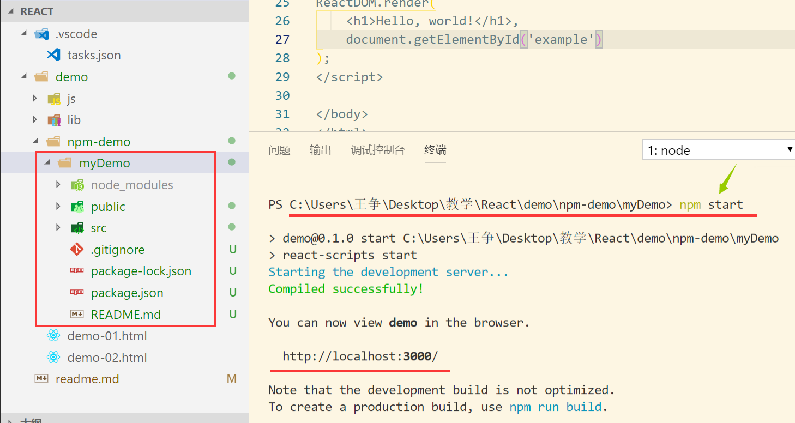
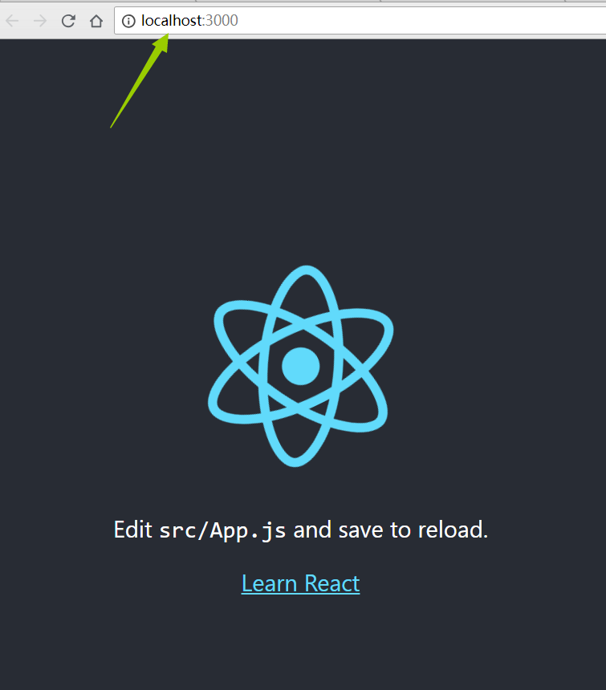

# React 简介

​       React 起源于 Facebook 的内部项目，因为该公司对市场上所有 JavaScript MVC 框架，都不满意，就决定自己写一套，用来架设Instagram 的网站。做出来以后，发现这套东西很好用，就在2013年5月开源了。

​       由于 React的设计思想极其独特，属于革命性创新，性能出众，代码逻辑却非常简单。所以，越来越多的人开始关注和使用，认为它可能是将来 Web 开发的主流工具。

​      这个项目本身也越滚越大，从最早的UI引擎变成了一整套前后端通吃的 Web App 解决方案。衍生的 React Native 项目，目标更是宏伟，希望用写 Web App 的方式去写 Native App。如果能够实现，整个互联网行业都会被颠覆，因为同一组人只需要写一次 UI ，就能同时运行在浏览器和手机。

# 第一个实例

```react
<!DOCTYPE html>
<html>
<head>
<meta charset="UTF-8" />
<title>Hello React!</title>
<script src="https://cdn.bootcss.com/react/16.4.0/umd/react.development.js"></script>
<script src="https://cdn.bootcss.com/react-dom/16.4.0/umd/react-dom.development.js"></script>
<script src="https://cdn.bootcss.com/babel-standalone/6.26.0/babel.min.js"></script>
</head>
<body>
 
<div id="example"></div>
    
<!-- react 使用的是JSX语法，如果我们需要使用 JSX，
则script标签的 type 属性需要设置为 text/babel。 -->
    
<script type="text/babel">
    
    
/* 将一个 h1 标题，插入 id="example" 节点中。*/ 

ReactDOM.render(
    <h1>Hello, world!</h1>,
    document.getElementById('example')
);
</script>
 
</body>
</html>
```

**实例解析：**

实例中我们引入了三个库： react.min.js 、react-dom.min.js 和 babel.min.js：

- **react.min.js** - React 的核心库
- **react-dom.min.js** - 提供与 DOM 相关的功能
- **babel.min.js** - Babel 可以将 ES6 代码转为 ES5 代码，这样我们就能在目前不支持 ES6 浏览器上执行 React 代码


# React 安装

1. 全局安装 create-react-app ：

   >  npm install -g create-react-app

2. 创建 myDemo 项目 : 

   > create-react-app myDemo

3. 切换到myDemo目录下

   > cd myDemo

4. 启动项目

   > npm start



   

5.浏览器会自动打开运行好的项目




# JSX 简介

JSX 是 react 中允许 js 和 html 混写的语法格式，需要依赖 babel 编译。

这里我就只研究它的语法：

```
const element = <h1>Hello, world!</h1>;
```

可以通过花括号在其中插入表达式：

```
function formatName(user){
  return user.firstName + ' ' + user.lastName;
}

const user = {
  firstName: 'Harper',
  lastName: 'Perez'
};

const element = (
  <h1>
    Hello, {formatName(user)}!
  </h1>
);

ReactDOM.render(
  element,
  document.getElementById('root')
);
```

可以将 HTML 语句写为多行以增加可读性，

用小括号括起来可以防止自动插入分号导致的错误。

JSX 也是个表达式，所以可以用在 for 和 if 中：

```
  function getGreeting(user){
    if (user){
      return <h1>Hello, {formatName(user)}!</h1>;
    }
    return <h1>Hello, Stranger.</h1>;
  }
```

我们可以正常使用引号给 HTML 标签添加属性，也可以使用 js 表达式

```
const element = <div tabIndex="0"></div>;

const element = ;   //注意空标签以 /> 结尾，像 XML 一样
```

注意 html 属性名请使用小驼峰(camelCase)写法


 # 元素渲染


## 元素渲染

在 `./public/index.html` 中有一个 id 为 root 的 div。我们将这个 div 作为 react 渲染的容器。

回看 hello world 程序，通过 ReactDOM.render() 方法很轻松的把内容渲染到了目标容器上：

```
ReactDOM.render(
  <h1> hello world! </h1>,
  document.getElementById('root')
);
```

当然也可以这样写：

```
let content = <h1> hello world! </h1>;
ReactDOM.render(
  content,
  document.getElementById('root')
);
```

