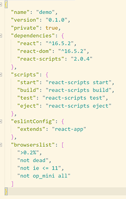
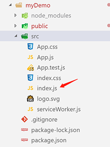
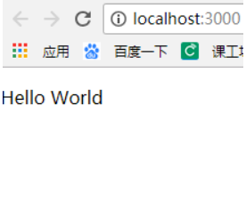
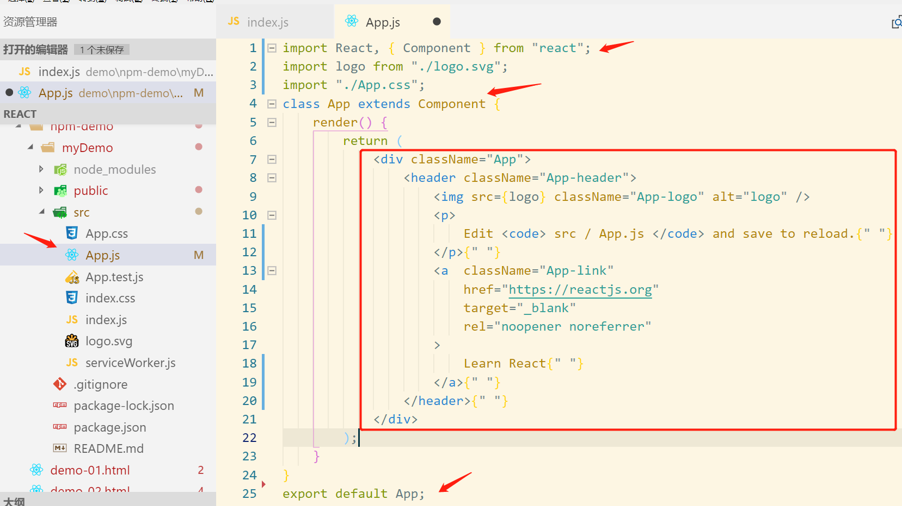
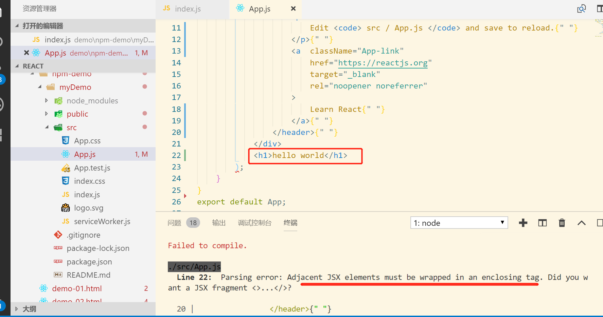
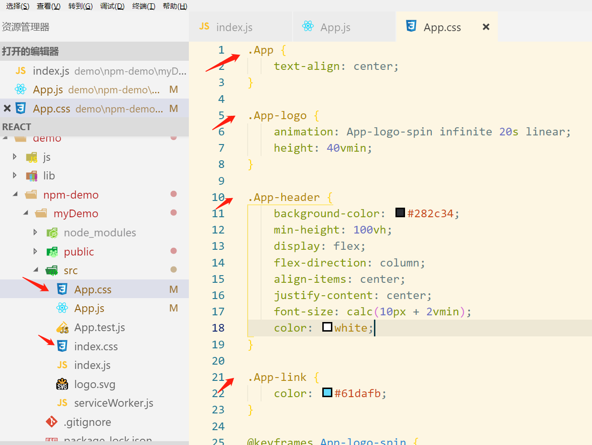

# React 简介

​     

## 是什么？       

React 是一个用于构建用户界面的渐进式 JavaScript 库

- 本身只处理 UI
- 不关心路由
- 不处理 ajax

​       React 起源于 Facebook 的内部项目，因为该公司对市场上所有 JavaScript MVC 框架，都不满意，就决定自己写一套，用来架设Instagram 的网站。做出来以后，发现这套东西很好用，就在2013年5月开源了。

​       由于 React的设计思想极其独特（组件化），属于革命性创新，性能出众，代码逻辑却非常简单。所以，越来越多的人开始关注和使用，认为它可能是将来 Web 开发的主流工具。

​      这个项目本身也越滚越大，从最早的UI引擎变成了一整套前后端通吃的 Web App 解决方案。衍生的 React Native 项目，目标更是宏伟，希望用写 Web App 的方式去写 Native App。如果能够实现，整个互联网行业都会被颠覆，因为同一组人只需要写一次 UI ，就能同时运行在浏览器和手机。

## React 特点

- 组件化
- 高效
  - 虚拟 DOM
  - Vue 2 也是虚拟 DOM
  - 虚拟 DOM 更高效
- 灵活
  - 渐进式，本身只处理 UI ，可以和你的其它技术栈组合到一起来使用
- 声明（配置）式设计
  - `data` 响应式数据
  - `mathods` 处理函数
  - 这样做的好处就是按照我们约定好的方式来开发，所有人写出来的代码就像一个人写的
  - `state`
  - 方法就是类成员
  - 也有特定的组件生命钩子
- JSX
  - 一种预编译 JavaScript 语言，允许让你的 JavaScript 和 HTML 混搭
  - 模板中就是 JavaScript 逻辑
- 单向数据流
  - 组件传值
  - 所有数据都是单向的，组件传递的数据都是单向
  - Vue 也是单向数据流
  - 没有双向数据绑定

# React、Vue、angular 对比

看看github星数吧


# 第一个实例

```react
<!DOCTYPE html>
<html>
<head>
<meta charset="UTF-8" />
<title>Hello React!</title>
<script src="https://cdn.bootcss.com/react/16.4.0/umd/react.development.js"></script>
<script src="https://cdn.bootcss.com/react-dom/16.4.0/umd/react-dom.development.js"></script>
<script src="https://cdn.bootcss.com/babel-standalone/6.26.0/babel.min.js"></script>
</head>
<body>
 
<div id="example"></div>
    
<!-- react 使用的是JSX语法，如果我们需要使用 JSX，
则script标签的 type 属性需要设置为 text/babel。 -->
    
<script type="text/babel">
    
    
/* 将一个 h1 标题，插入 id="example" 节点中。*/ 

ReactDOM.render(
    <h1>Hello, world!</h1>,
    document.getElementById('example')
);
</script>
 
</body>
</html>
```

**实例解析：**

实例中我们引入了三个库： react.min.js 、react-dom.min.js 和 babel.min.js：

- **react.min.js** - React 的核心库
- **react-dom.min.js** - 提供与 DOM 相关的功能
- **babel.min.js** - Babel 可以将 ES6 代码转为 ES5 代码，这样我们就能在目前不支持 ES6 浏览器上执行 React 代码


# React 安装

1. 全局安装 create-react-app ：

   >  npm install -g create-react-app

2. 创建 myDemo 项目 : 

   > create-react-app myDemo

3. 切换到myDemo目录下

   > cd myDemo

4. 启动项目

   > npm start


   

5.浏览器会自动打开运行好的项目


React 目录结构

**package.json**




这个文件是管理下载的依赖包,在项目中经常用到的是"react"库，“react-dom”（将jsx语法渲染到dom中）

在项目中最重要的命令是“start”启动项目，"bulid"的作用就是将项目打包。


**node_modules：**

这里面包含了react项目中会用到的一些组件，install的时候下载下来的


**public文件夹**

   1).favicon.ico

​       是浏览器tab上图标，也是这个项目的一个标志，也可以说是代表一个公司的标志。可以替换。

   2).index.html

​       项目的入口文件，引用了第三方类库啊，还可以引入cdn

​      <div id="root"></div> 是项目的总容器，所有的内容存储在这个容器中。这个容器有且只能有一个。

 **src：**

1).index.js

​    

src 里面存放的是这个项目的核心内容，也就是我们的主要工作区域。

其中，index.js文件是和index.html进行关联的文件。index.js的内容结构：

```react
import React from 'react';
import ReactDOM from 'react-dom';
import './index.css';
import App from './App';
import registerServiceWorker from './registerServiceWorker';

ReactDOM.render(<App />, document.getElementById('root'));
registerServiceWorker();
```

ReactDOM.render(）的作用是将<App/>的内容渲染到根“root”中去。

document.getElementById('root')中的"root"便是index.html中的"root"了，

<App />便是引用页面内容了。

在这里，<App />也可以写一些内容(结构,样式,逻辑)是整个项目的根组件，比如:

ReactDOM.render(<p >Hello World</p>, document.getElementById('root'));

运行结果（前提是本地服务器启动，打开localhost:3000）如下：



 2).App.js

 

App类是继承react提供的component，

export default App;是为了将App公开，index.js才能够引用。

App.js继承了component的话，必须使用render进行渲染。

return的内容是类似于html结构的内容，就是jsx，

jsx语法是react的主要语法。

内部的div的className是为了区分html语法的一个类名，

这个是div的样式引用。在这个文件中，只能用一个div容器，如果在div的同级目录添加别的内容，便会报错。




className="App"，是引用到App.css的样式。




注意，页面内容样式是就近原则，

首先用App.css的样式，App.css是组件的样式，index.css是全局的样式。


# JSX 简介

JSX 是 react 中允许 js 和 html 混写的语法格式，需要依赖 babel 编译。

这里我就只研究它的语法：

```
const element = <h1>Hello, world!</h1>;
```

可以通过花括号在其中插入表达式：

```
function formatName(user){
  return user.firstName + ' ' + user.lastName;
}

const user = {
  firstName: 'Harper',
  lastName: 'Perez'
};

const element = (
  <h1>
    Hello, {formatName(user)}!
  </h1>
);

ReactDOM.render(
  element,
  document.getElementById('root')
);
```

可以将 HTML 语句写为多行以增加可读性，

用小括号括起来可以防止自动插入分号导致的错误。

JSX 也是个表达式，所以可以用在 for 和 if 中：

```
  function getGreeting(user){
    if (user){
      return <h1>Hello, {formatName(user)}!</h1>;
    }
    return <h1>Hello, Stranger.</h1>;
  }
```

我们可以正常使用引号给 HTML 标签添加属性，也可以使用 js 表达式

```
const element = <div tabIndex="0"></div>;

const element = ;   //注意空标签以 /> 结尾，像 XML 一样
```

注意 html 属性名请使用小驼峰(camelCase)写法


 # 元素渲染

在 `./public/index.html` 中有一个 id 为 root 的 div。我们将这个 div 作为 react 渲染的容器。

回看 hello world 程序，通过 ReactDOM.render() 方法很轻松的把内容渲染到了目标容器上：

```
ReactDOM.render(
  <h1> hello world! </h1>,
  document.getElementById('root')
);
```

当然也可以这样写：

```
let content = <h1> hello world! </h1>;
ReactDOM.render(
  content,
  document.getElementById('root')
);
```


# 组件

React 给我们提供了组件，可以更好的管理我们的代码。

React 建议组件名的首字母大写

先看下面代码，下面代码会输出 ”Hello Sara"

```react
function Welcome(props){
  return <h1>Hello, {props.name}</h1>;
}

//自定义标签,调用了 Welcome 函数，并且将所有的属性(这里只有name)打包为一个对象传给 Welcome 函数
const element = <Welcome name="Sara" />;

ReactDOM.render(
  element,
  document.getElementById('root')
);
```

组件帮助我们做一些重复的工作，比如这样：

```react
function Welcome(props){
  return <h1>Hello, {props.name}</h1>;
}

function App(){
  return (
    <div>
      <Welcome name="Sara" />
      <Welcome name="Cahal" />
      <Welcome name="Edite" />
    </div>
  );
}

ReactDOM.render(
  <App />,
  document.getElementById('root')
);
```

我们可以通过传递参数得到同一个组件构建的不同模块。

